# CSCB862 Проект по практическо въведение в софтуерното тестване
## F95722 Георги Ивов Димитров

Тестване относно обекта на тесването (Functional, UI, Localization and etc.
testing). Приложете тестването върху
https://www.gamesparkles.com/games/buggle

# Увод

Тестването на софтуерен продукт е изключително важна част от разработването на модерен, устойчив и работещ софтуер. В една вечно променяща се информационна и технологична среда, обстойното тестване на всички елементи от един софтуер позволяват на екипът зад него да взимат ключови решения относно разработката на техния продукт, като това дава шанс да получат реална представа за качеството му, недостатъците, дефектите му.

Изграждането на обстоен и всеобхващащ тестов план е ключова част от контрола на качеството на една софтуерна разработка и крайния резултат от нея. Детайлното описание на стъпките нужни за провеждането на тези тестове осигуряват повтаряемост, като това допринася за високото доверие към резултатите. Изпълняването на тези тестове често и в правилните етапи от цикъла на разработка подобряват устойчивостта, качеството и стабилността на софтуера, а детайлната обратна връзка от тези тестове помага на разработчиците и подобрява времето за разрешаване на откритите дефекти, регресии и неточности в изпълнението.

Спрямо връченото задание, долу описаните тестове бяха проведени върху дадения обект за тестване `https://apps.facebook.com/playbuggle/`, а именно Facebook игра. Важното за такъв тип софтуер е високата съвместимост с различни устройства и различни среди (компютри, телефони и тн) с цел привличането на възможно най-много потребители, както и потенциални платени клиенти чрез виртуалните покупки. Проблеми и дефекти бързо биха отблъснали потребителите на играта, което би било силно негативно от бизнес страна.

Тестовете ще са фокусирани върху функционалността, локализацията и интерфейсът на продукта, като те ще се провеждат под различни платформи и среди.

# Тестов план

Всеки проведен тест е описан в следния формат:

1. Кратко описание на целите на дадения тест
2. Стъпки, изпълнявани за провеждането на теста
3. Очаквания резултат от теста

Под описанието на теста се намират и резултатите от неговото провеждане в табличен вид. Всеки проведен тест има:

1. Дата
2. Описание на условията, под който е проведен тестът
3. Резултат (успех, неуспех, забележки)
4. Коментар по резултата
5. Възможни идеи и решения

След тест резултатите, ако са наблюдавани несъответствия, нестабилност и неуспехи, са дадени и описани примерни доклади за дефекти, които следват приложения формат:

- **Тип дефект:** Категория, определящо естеството на дефекта с две-три думи
- **Описание:** Кратко описание за дефекта (условия, грешки, несъответствия)
- **Снимки от екрана:**  Снимки на екрана, показващи дефекта с възможни пояснения
- **Стъпки за репродуциране:**  Кратки и точни стъпки нужни за проявяването на дефекта
- **Очакван резултат:** Описание на очаквания резултат според бизнес изискванията и/или потребителските очаквания
- **Наблюдаван резултат:**  Описание на наблюдавания резултат в момента на тестване
- **Честота на проявяване:** Показва съотношението между проявен дефект / опити за проява (пет опита, два от които успешни т.е. 2/5)
- **Среда:** Подробности относно средата, върху която дефектът е наблюдаван и репродуциран
  

# Проведени тестове

## 1. Начален етап на ползване. Процедура по удостоверение. Зареждане

Тестът проверява възможността потребител да се регистрира, да даде нужните разрешения на играта и успешно да достъпи главното меню, за да може да започне своята игра.

### Стъпки

1. Създава се нов Facebook потребителски профил с случаен имейл адрес
2. Навигира се към страницата на играта във Facebook
3. Клика се върху "Play Now"
4. В новоотворения се диалогов прозорец даваме нужните за играта разрешения (достъп до общи профилни данни, имейл адрес, списък с приятели).

### Очакван резултат

Играта зарежда и навигира до началния си екран

### Тест резултати

| Дата | Условия | Резултат | Коментар | Възможни подобрения     |
|------|---------|----------|----------|-------------------------|
|22:36 10.12.2023    |  Новосъздаден акаунт без приятели без дадено разрешение за достъп до списъка с приятели  |  Неуспех❌        | Играта отказва да продължи към зареждане. Страницата се презарежда без промяна.| Съобщение за нуждата от достъп до списъка с приятели |
|22:58 10.12.2023     | Новосъздаден акаунт без приятели с дадено разрешение за достъп до списъка с приятели, |  Неуспех❌        | Играта отказва да продължи към зареждане. Страницата се презарежда без промяна.| Базирайки се на първия проведен тест, възможно е проверката за достъп до приятели да е невалидна, например проверява се дали списъка с приятели има дължина над 0, а не дали играта има достъп до списъка с приятели |
|00:43 11.12.2023      |Новосъздаден акаунт с 1 приятел с дадено разрешение за достъп до списъка с приятели |  Успех✅        | Играта успешно продължава да зареждана и главното меню на играта става достъпно.|  |

### Доклад за дефект

#### 1. При отказ за разрешение за достъп до списък с приятели във Фейсбук

- **Тип дефект:** Проблеми с ползване на продукта
- **Описание:** При отказ за разрешение за достъп до списък с приятели във Фейсбук, играта не зарежда, а потребителят е оставен без известие и причина за проблемите.
- **Снимки от екрана:**   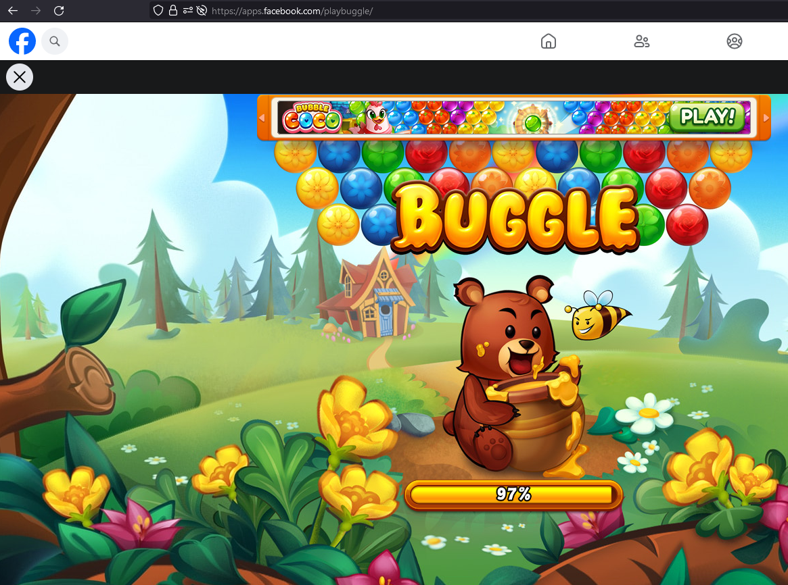
- **Стъпки за репродуциране:**  
  - 1. С нов за играта акаунт, навигираме до уеб адрес на играта във Фейсбук `https://apps.facebook.com/playbuggle/`
  - 2. В новоотворилия се диалогов прозорец за разрешения, отказваме достъп до списъка с приятели
  - 3. Потвърждаваме избора си
- **Очакван резултат:** Спрямо бизнес изискванията. Възможности:
  - Играта зарежда без достъп до приятелите на потребителя с намалени социални възможности и функционалности
  - Играта не зарежда, но уведомява потребителя за проблема и как той може да бъде решен  
- **Наблюдаван резултат:**  Страницата презарежда и играта остава в незаредено състояние
- **Честота на проявяване:** 10/10  
- **Среда:** Windows 10 / Firefox 121.0
  
#### 2. При липса на приятели във Фейсбук

- **Тип дефект:** Проблеми с ползване на продукта
- **Описание:** При липса на приятели в списъка с приятели, играта не зарежда, потребителят е оставен без известие и причина за проблемите.
- **Снимки от екрана:**  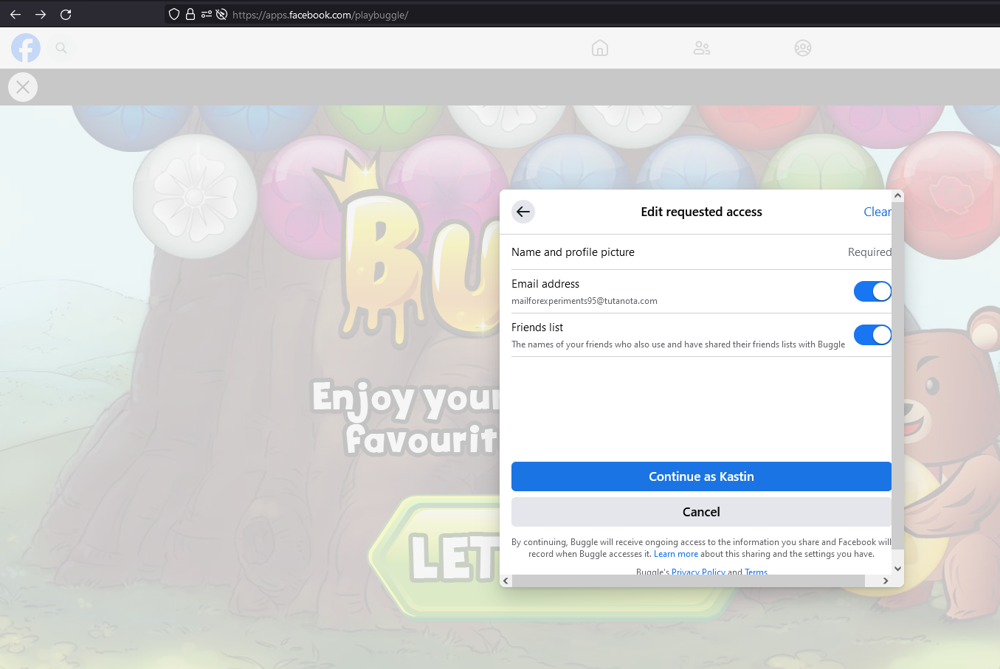 
- **Стъпки за репродуциране:**  
  - 1. С нов за играта акаунт без приятели, навигираме до уеб адрес на играта във Фейсбук `https://apps.facebook.com/playbuggle/`
  - 2. В новоотворилия се диалогов прозорец за разрешения, разрешаваме достъп до списъка с приятели
  - 3. Потвърждаваме избора си
- **Очакван резултат:**  Играта зарежда без проблеми и потребителя използва приложението с всички възможни функционалности
- **Наблюдаван резултат:**  Страницата презарежда, зареждането на играта остава в недовършено състояние, без прогрес
- **Честота на проявяване:** 10/10  
- **Среда:** Windows 10 / Firefox 121.0

## 2. Зареждане на първо ниво с инструкции и играене

Тестът верифицира основния поток на 'работа' на играчите, започване на игра на първото ниво, съдържащо инструкции за правилата на играта, и завършване успешно. Тестът подлага и под верификация инструкциите, тяхната точност и многоезичност

### Стъпки

1. След навигирането до заглавната страница, в менюто за избор на нива се избира ниво 1
2. Клик върху големия зелен бутон "Play"
3. Потвърждаване на прозорците с инструкции
4. Завършване на нивото

### Очакван резултат

След зареждане, потребителя получава кратки инструкции относно играта (управление, бутони, правила и цел на играта)

След изиграване на новото, играча получава информация за броя точки, които е натрупал, както и броя звезди, базирани на натрупалия се резултат.

### Тест резултат

| Дата | Условия | Резултат | Коментар | Възможни подобрения     |
|------|---------|----------|----------|-------------------------|
|15:53 27.12.2023    | Опцията за локализация в потребителския акаунт във Фейсбук е настроена на English UK    |  Успех✅        | Играта успешно зарежда и информира потребителите за управлението на играта, както и правилата и целите на английски език.|  |
|16:03 27.12.2023     | Опцията за локализация в потребителския акаунт във Фейсбук е настроена на Deutsch |  Неуспех❌        | Играта успешно зарежда и информира потребителите за управлението на играта, както и правилата и целите, но на английски език, т.е немската локализация и преводи не са налични.| Локализацията трябва да бъде налице, инструкциите да са на немски език. |
|16:11 27.12.2023      |Опцията за локализация в потребителския акаунт във Фейсбук е настроена на Français (France) |  Неуспех❌      | Играта успешно зарежда и информира потребителите за управлението на играта, както и правилата и целите, но на английски език, т.е френската локализация и преводи не са налични.| Локализацията трябва да бъде налице, инструкциите да са на френски език. |

### Извод

От горе проведените тестове разбираме, че софтуерът не разполага с локализация и преводи спрямо настройките на потребителя във Фейсбук. Опцията за език също не е налична самостоятелно в софтуера.

### Доклад за дефект

- **Тип дефект:** Проблеми с локализирането на продукта
- **Описание:** При игра с потребителски акаунт с език различен от английски, елементите на интерфейса, текстовете и т.н не са преведени и локализирани.
- **Снимки от екрана:**  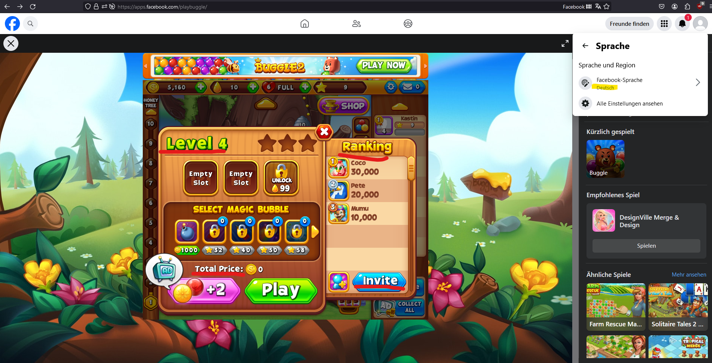 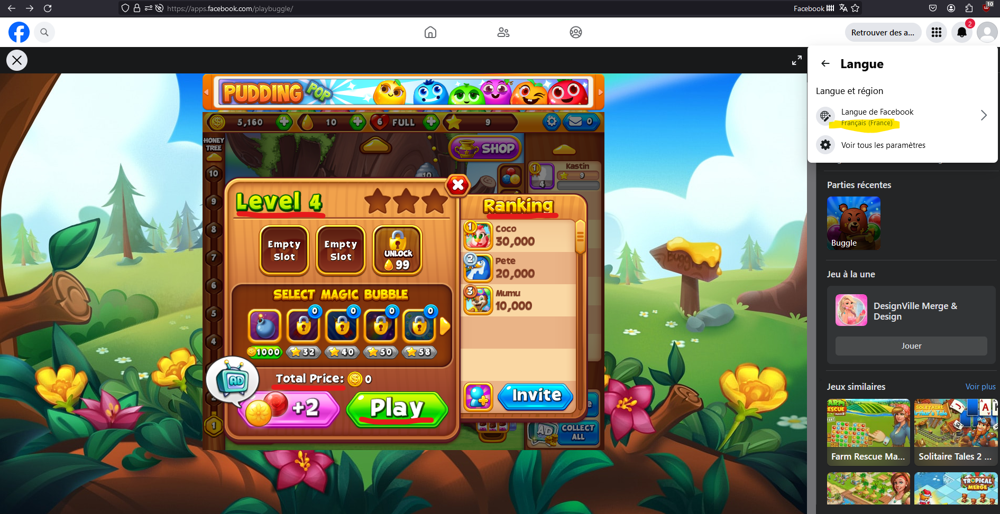 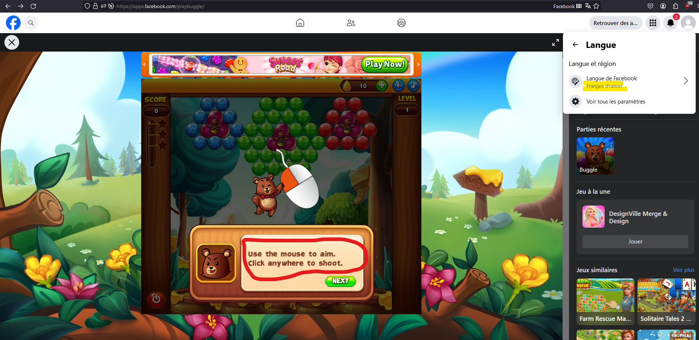
- **Стъпки за репродуциране:**  
  - 1. Сменяме езика на потребителския акаунт в Фейсбук с различен от английски
  - 2. Навигираме до уеб адрес на играта във Фейсбук `https://apps.facebook.com/playbuggle/`
  - 3. След зареждане на играта, наблюдаваме интерфейсът и текстовете в нея
- **Очакван резултат:**  Играта зарежда и всички елементи свързани с локализация, като текст и цени, са съобразени с предпочитанията на потребителя спрямо неговите настройки във Фейсбук.
- **Наблюдаван резултат:**  Играта зарежда, всички елементи са на първоначалния си английски език.
- **Честота на проявяване:** 10/10  
- **Среда:** Windows 10 / Firefox 121.0

## 3. Работа под различни платформи/браузъри

Тестът валидира работата на софтуера под различни платформи и браузъри с цел проверка за различни несъвместимости и несъответствия в работата на играта.

### Стъпки

1. Зареждане на играта
2. След навигирането до заглавната страница, в менюто за избор на нива се избира ниво 1
3. Клик върху големия зелен бутон "Play"
4. Потвърждаване на прозорците с инструкции
5. Завършване на нивото

### Тест резултат

| Дата | Условия | Резултат | Коментар | Възможни подобрения     |
|------|---------|----------|----------|-------------------------|
|22:23 27.12.2023    | Проведен под Firefox 121.0 / Windows 10    |  Успех✅        | Играта успешно зарежда и тестът премина успешно.|  |
|22:25 27.12.2023     | Проведен под Chrome 120.0.6099.130 / Windows 10 |  Успех✅     | Играта успешно зарежда и тестът премина успешно.| |
|22:31 27.12.2023      | Проведен под Chrome 120.0.6099.116 / Android 13 |  Неуспех❌      | Играта не зарежда успешно. Тестът не може да продължи| Нужен е по-дълбок анализ от екипът от разработчици и да се разгледат причините за проблема |
|22:41 27.12.2023      | Проведен под Firefox Mobile 120.1 / Android 13 |  Успех с забележки 🚧      | Играта успешно зарежда и тестът премина успешно, но интерфейсът и инструкциите не са адаптирани за мобилната платформа. Графиките показваха компютърна мишка, когато такава не е налична.| Интерфейсът се нуждае от подобрения с цел улесняване на ползването на приложението на мобилни устройства. Инструкциите трябва да са адаптивни спрямо средата на потребителя. |

### Доклад за дефект

#### 1. Проблеми с работата под  Android 13 / Chrome 120.0.6099.116

- **Тип дефект:** Проблеми с ползване на продукта
- **Описание:** При опити за игра от мобилни устройства с Chrome браузър, играта не зарежда.
- **Снимки от екрана:**  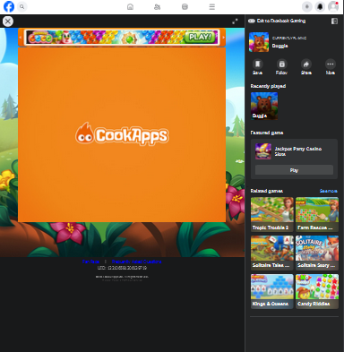
- **Стъпки за репродуциране:**  
  - 1. На мобилно устройство с Chrome, навигираме към `https://apps.facebook.com/playbuggle/`
  - 2. Играта започва да зарежда
- **Очакван резултат:**  Играта зарежда и всички елементи са адаптирани за мобилното устройство
- **Наблюдаван резултат:**  Играта стига до логото на разработчика и не продължава зареждането си
- **Честота на проявяване:** 10/10  
- **Среда:** Android 13 / Chrome 120.0.6099.116

#### 2. Проблеми с интерфейс при мобилни устройства

- **Тип дефект:** Проблеми с ползване на продукта
- **Описание:** При опити за игра от мобилни устройства с Firefox играта зарежда, но интерфейсът не е адаптиран за платформата и играта реално е неизползваема
- **Снимки от екрана:**  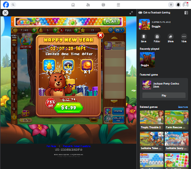
- **Стъпки за репродуциране:**  
  - 1. На мобилно устройство с Firefox, навигираме към `https://apps.facebook.com/playbuggle/`
  - 2. Играта завършва зареждането си
- **Очакван резултат:**  Играта зарежда и всички елементи са адаптирани за мобилното устройство
- **Наблюдаван резултат:**  Играта зарежда, но интерфейсът не е удобен за мобилната платформа. Инструкциите все още показват компютърна мишка.
- **Честота на проявяване:** 10/10  
- **Среда:** Android 13 / Firefox Mobile 120.1

## 4. UI тестове под различни разделителни способоности
Целта на теста е да валидира работата на играта и позиционирането на нейните интерфейс елементи под различни разделителни способности.

### Стъпки

1. Сменяме разделителната способност на работната среда
2. Зареждаме играта и навигираме из главните менюта

### Тест резултати

| Дата | Условия | Резултат | Коментар | Възможни подобрения     |
|------|---------|----------|----------|-------------------------|
|17:33 06.01.2024    | Проведен под 800 x 600 / Firefox 121.0 / Windows 10  |  Неуспех❌  | Тестът премина, но има проблеми с използваемостта, прозорецът на играта не се събира и е нужно да се ползват страничните скролове за консумацията на цялото съдържание.| Намаляване на размера на прозореца с цел съдържанието да се събере успешно спрямо по-ниски резолюции |
|17:42 06.01.2024     | Проведен под 1024 x 768 / Firefox 121.0 / Windows 10 |  Неуспех❌     | Тестът премина, но има проблеми с използваемостта, прозорецът на играта не се събира и е нужно да се ползват страничните скролове за консумацията на цялото съдържание.| Намаляване на размера на прозореца с цел съдържанието да се събере успешно спрямо по-ниски резолюции |
|16:11 07.01.2024     | Проведен под 1280 x 720 / Firefox 121.0 / Windows 10 |  Неуспех❌    | Тестът премина, но има проблеми с използваемостта, прозорецът на играта не се събира и е нужно да се ползват страничните скролове за консумацията на цялото съдържание.| Намаляване на размера на прозореца с цел съдържанието да се събере успешно спрямо по-ниски резолюции. Тази резолюция все още е сравнително използвана и правилната функционалност на играта под нея е от голяма важност. |
|16:11 07.01.2024     | Проведен под 1280 x 1024 / Firefox 121.0 / Windows 10 |  Успех✅     | Тестът премина успешно, съдържането на играта се събира на екрана без нужда от ползване на скорлове. | |
|16:23 07.01.2024     | Проведен под 1920 x 1080 / Firefox 121.0 / Windows 10 |  Успех✅     | Тестът премина успешно, съдържането на играта се събира на екрана без нужда от ползване на скорлове. | |
|16:28 07.01.2024     | Проведен под 3840 x 2160 / Firefox 121.0 / Windows 10 |  Забележки🚧     | Тестът премина, но има проблеми с използваемостта; Интерфейсът на играта се събира в прозорецът, но някой текстови елементи стават прекалено малки за четене и може да са неудобни за потребители с увредено зрение. | Размерът на прозорецът трябва да се адаптира спрямо резолюцията на потребителя, вкл. и да се разширява, ако такава възможност е налична|

### Доклад за дефект

#### 1. Проблем при ниски резолюции

- **Тип дефект:** Проблеми с ползване на продукта
- **Описание:** При опити за игра на десктоп устройства с ниска резолюция, играта не се побира коректно в наличния прозорец
- **Снимки от екрана:**   800x600 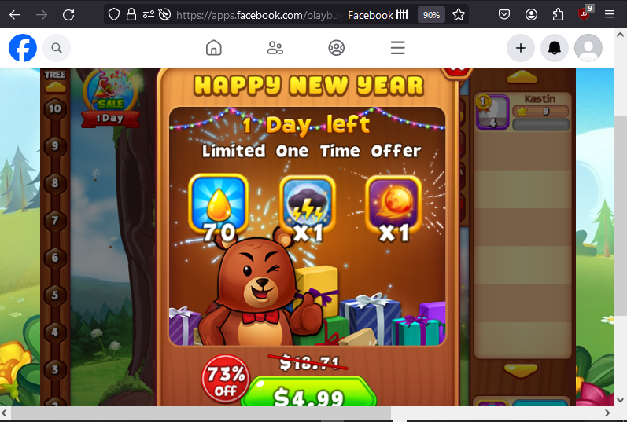
1024 x 768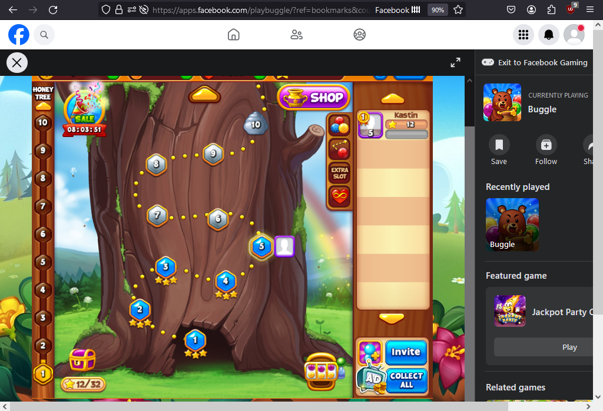
1280 x 720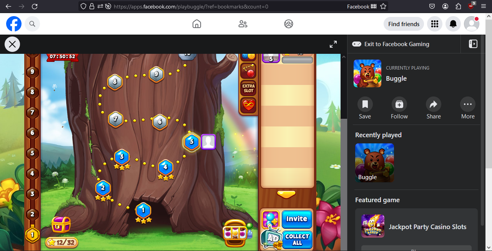
- **Стъпки за репродуциране:**  
  - 1. Настройваме резолюцията на нашия дисплей до желаната за тест
  - 2. Навигираме към `https://apps.facebook.com/playbuggle/`
  - 3. Играта завършва зареждането си
  - 4. Наблюдаваме разположението на интерфейсът на играта
- **Очакван резултат:**  Играта зарежда и всички елементи са адаптирани за дадената резолюция, т.е. играта се побира в дадения прозорец
- **Наблюдаван резултат:**  Играта зарежда, но интерфейсът не се побира в дадения прозорец, нужно е навигиране със хоризонталните и вертикалните сроклове на браузъра
- **Честота на проявяване:** 10/10  
- **Среда:** Windows 10 / Firefox 121.0

#### 2. Проблем при високи резолюции

- **Тип дефект:** Проблеми с ползване на продукта
- **Описание:** При опити за игра на десктоп устройства с висока резолюция (> 2K) интерфейсът на играта е прекалено дребен
- **Снимки от екрана:**   3840 x 2160 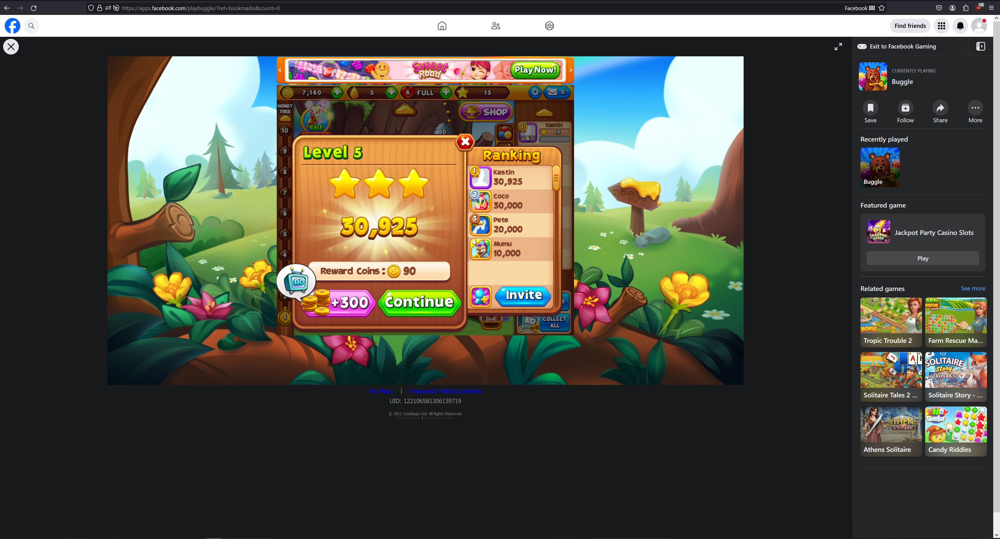
- **Стъпки за репродуциране:**  
  - 1. Настройваме резолюцията на нашия дисплей до желаната за тест
  - 2. Навигираме към `https://apps.facebook.com/playbuggle/`
  - 3. Играта завършва зареждането си
  - 4. Наблюдаваме разположението на интерфейсът на играта
- **Очакван резултат:**  Играта зарежда и всички елементи са адаптирани за дадената резолюция, т.е. играта и нейните интерфейс елементи правилно се уголемяват спрямо наличното пространство
- **Наблюдаван резултат:**  Играта зарежда, но интерфейсът е прекалено дребен, бутоните са малки, а текст елементите са трудни за четене
- **Честота на проявяване:** 10/10  
- **Среда:** Windows 10 / Firefox 121.0

## 5. Променливи мрежови условия - Загуба на интернет връзка
Целта на теста е да провери работата на приложението при загуба на интернет връзка по време на ползване от потребителя.

### Стъпки

1. Навигираме към играта и оставяме да зареди до главното си меню за избиране на ниво
2. Отваряме Firefox DevTools или Chrome DevTools
3. В разделът Network избираме 'No connection' като опция за симулиране
4. Опитваме да заредим ниво

### Очакван резултат

Според бизнес изискванията и архитектурните възможности:

1. Играта продължава да функционира с намалени социални възможности и функционалности
2. Играта показва известие, че потребителят е офлайн и трябва да възстанови връзката, за да продължи своята игра

### Тест резултати

| Дата | Условия | Резултат | Коментар | Възможни подобрения     |
|------|---------|----------|----------|-------------------------|
|21:11 06.01.2024    | Проведен под Firefox 121.0 / Windows 10  |  Неуспех❌ | При спиране на връзката и избиране на ниво, екранът с информация за избраното ниво не зарежда, а играта остава в неизползваемо състояние, невъзможна е навигацията до презареждане на страницата| Известяване на потребителя за възникналия проблем |
|21:23 06.01.2024     | Проведен под Chrome 120.0.6099.130 / Windows 10 |  Неуспех❌ | При спиране на връзката и избиране на ниво, екранът с информация за избраното ниво не зарежда, а играта остава в неизползваемо състояние, невъзможна е навигацията до презареждане на страницата| Известяване на потребителя за възникналия проблем

### Доклад за дефект

- **Тип дефект:** Проблеми с използването на продукта (UX)
- **Описание:** При губене на връзка с интернет, играта остава в неизползваемо състояние и не отговаря на действията на потребителя докато той ръчно не презареди страницата след като е възстановил връзка
- **Снимки от екрана:**  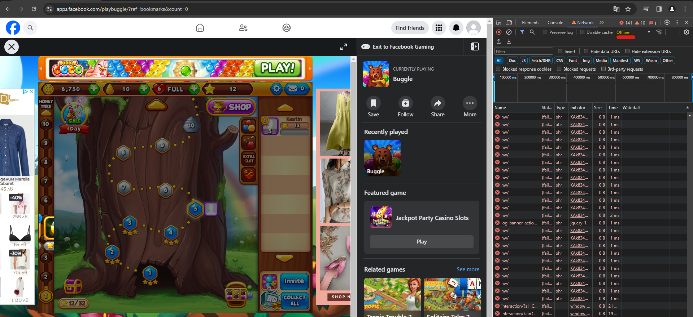
- **Стъпки за репродуциране:**  
  - 1. Навигираме до уеб адрес на играта във Фейсбук `https://apps.facebook.com/playbuggle/`
  - 2. Навигираме до менюто за избор на ниво
  - 3. С помощта на devtools симулираме загуба на интернет връзка
  - 4. Натискаме върху произволно ниво
- **Очакван резултат:**  Играта ни известява за липсата на интернет връзка и изчаква тя да бъде възстановена
- **Наблюдаван резултат:**  Играта остава в неизползваемо състояние до презареждането на страницата
- **Честота на проявяване:** 10/10  
- **Среда:** Windows 10 / Chrome 120.0.6099.130

# Наблюдения и изводи от проведените тестове

Софтуерът изпълнява основната си функционалност, но разполага с проблеми и дефекти, които могат да усложнят и ограничат използваемостта му от набор от потребители. Проблемите варират от липса на локализация, до липса на адаптивен дизайн, позволяващ игра на мобилни и таблетни устройства. Липсва също така устойчивост на работа при променливи мрежови и интернет условия.

Следващото представлява кръгова диаграма на резултата от проведените тестове, както и тяхната оценка.

Трябва да имаме предвид че проведените тестове са тясно специализирани в дадените ни от заданието точки (функционално, локализация, UI). Играта изпълнява базовите си функционалности без особени проблеми при средно статистически десктоп/лаптоп системи (Windows 10, Chrome/Firefox, 1080p разделителна способност, налична стабилна интернет връзка), но има големи пропуски при по-разнообразни среди и устройства.

Внимателен анализ на афектирания брой клиенти спрямо статистически данни за потребителите на играта (тип устройство, резолюция, държава и език) трябва да бъде предоставен на заинтересованите страни. Захранени с тази информация, те могат, спрямо наличните бизнес възможности (време, бюджет, персонал, приоритети), да вземат информирано решение за редът на решаване и приоритизиране на всеки от горе описаните дефекти.

# Източници

1. ‌Al, B.E. (2012) *Foundations of Software Testing: ISTQB certification.* London: Cengage Learning EMEA.
2. C., P. (no date) *Beginners Guide to Software Testing, Software Testing Genius.* Available at: http://softwaretestinggenius.com/download/bgstpadmini.pdf (Accessed: 13 January 2024).
3. Rätzmann, M. and Young, C.D. (2003) *Software testing and internationalization.* Salt Lake City: Lemoine International, Inc.